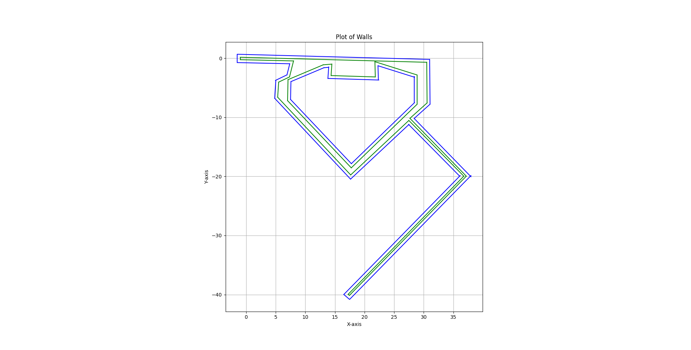
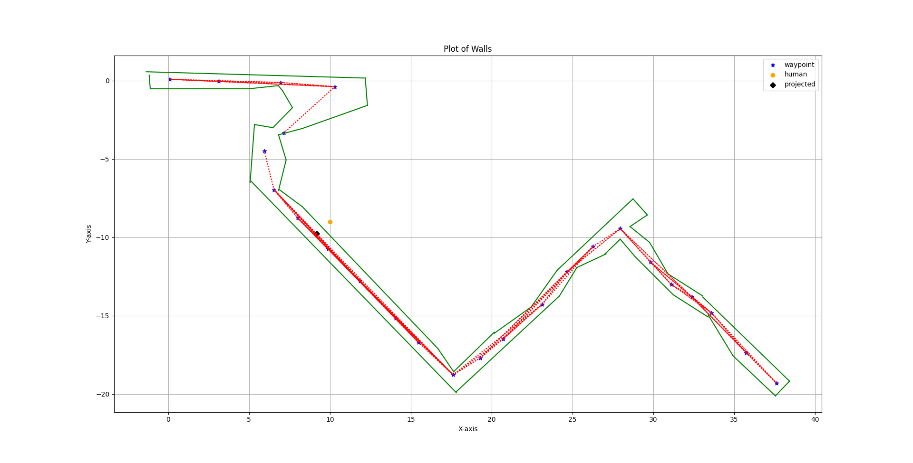

<!-- Improved compatibility of back to top link: See: https://github.com/othneildrew/Best-README-Template/pull/73 -->
<a name="readme-top"></a>
<!--
*** Thanks for checking out the Best-README-Template. If you have a suggestion
*** that would make this better, please fork the repo and create a pull request
*** or simply open an issue with the tag "enhancement".
*** Don't forget to give the project a star!
*** Thanks again! Now go create something AMAZING! :D
-->


<!-- PROJECT SHIELDS -->
<!--
*** I'm using markdown "reference style" links for readability.
*** Reference links are enclosed in brackets [ ] instead of parentheses ( ).
*** See the bottom of this document for the declaration of the reference variables
*** for contributors-url, forks-url, etc. This is an optional, concise syntax you may use.
*** https://www.markdownguide.org/basic-syntax/#reference-style-links
-->
[![Contributors][contributors-shield]][contributors-url]
[![Forks][forks-shield]][forks-url]
[![Stargazers][stars-shield]][stars-url]
[![Issues][issues-shield]][issues-url]
[![MIT License][license-shield]][license-url]


<!-- PROJECT LOGO -->
<br />
<div align="center">
  <a href="https://github.com/Sentientplatypus/jackal">
    
  </a>

<h3 align="center">Jackal</h3>

  <p align="center">
    In the verifiable robotics research group at Cornell, our goal is to develop a robot that helps evacuate people out of buildings. our robot, named jackal has been used in pilot studies studying human-robot interaction when there are contradicting values. For example, in an emergency, people will often search for their valuables before exiting the building, thus decreasing their chances of survival. The robot on the other hand, will want to exit the building. We are studying the best robot behaviors to get the people to follow it faster. 
    <br /> 
    <a href="https://github.com/Sentientplatypus/jackal"><strong>Explore the docs »</strong></a>
    <br />
    <br />
    <a href="https://github.com/Sentientplatypus/jackal">View Demo</a>
    ·
    <a href="https://github.com/Sentientplatypus/jackal/issues">Report Bug</a>
    ·
    <a href="https://github.com/Sentientplatypus/jackal/issues">Request Feature</a>
  </p>
</div>


<!-- TABLE OF CONTENTS -->
<details>
  <summary>Table of Contents</summary>
  <ol>
    <li>
      <a href="#about-the-project">About The Project</a>
      <ul>
        <li><a href="#built-with">Built With</a></li>
      </ul>
    </li>
    <li>
      <a href="#getting-started">Getting Started</a>
      <ul>
        <li><a href="#prerequisites">Prerequisites</a></li>
        <li><a href="#installation">Installation</a></li>
      </ul>
    </li>
    <li><a href="#usage">Usage</a></li>
    <li><a href="#roadmap">Roadmap</a></li>
    <li><a href="#contributing">Contributing</a></li>
    <li><a href="#license">License</a></li>
    <li><a href="#contact">Contact</a></li>
    <li><a href="#acknowledgments">Acknowledgments</a></li>
  </ol>
</details>


<!-- ABOUT THE PROJECT -->
## About The Project

[![Product Name Screen Shot][product-screenshot]](https://example.com)

Things

<p align="right">(<a href="#readme-top">back to top</a>)</p>


### Built With

* [![Next][python]][python-url]

<p align="right">(<a href="#readme-top">back to top</a>)</p>


<!-- GETTING STARTED -->
## Getting Started

I worked bloating the walls. This step ensures that the robot does not run into walls. I do this by taking the walls and sort of "bloating" them and telling the robot those bloated walls are the real walls. Additionally, I worked on creating a ROS node for projecting a human position onto the a predetermined roadmap so the robot can go to it.

This is bloating:


This is projecting a human onto the roadmap:


### Prerequisites

This is an example of how to list things you need to use the software and how to install them.
* npm
  ```sh
  npm install npm@latest -g
  ```

### Installation


1. Clone the repo
   ```sh
   git clone https://github.com/Sentientplatypus/jackal.git
   ```


<p align="right">(<a href="#readme-top">back to top</a>)</p>


<!-- USAGE EXAMPLES -->
## Usage

Use this space to show useful examples of how a project can be used. Additional screenshots, code examples and demos work well in this space. You may also link to more resources.

_For more examples, please refer to the [Documentation](https://example.com)_

<p align="right">(<a href="#readme-top">back to top</a>)</p>


<!-- ROADMAP -->
## Roadmap

- [ ] Feature 1
- [ ] Feature 2
- [ ] Feature 3
    - [ ] Nested Feature

See the [open issues](https://github.com/Sentientplatypus/jackal/issues) for a full list of proposed features (and known issues).

<p align="right">(<a href="#readme-top">back to top</a>)</p>


<!-- CONTRIBUTING -->
## Contributing

Contributions are what make the open source community such an amazing place to learn, inspire, and create. Any contributions you make are **greatly appreciated**.

If you have a suggestion that would make this better, please fork the repo and create a pull request. You can also simply open an issue with the tag "enhancement".
Don't forget to give the project a star! Thanks again!

1. Fork the Project
2. Create your Feature Branch (`git checkout -b feature/AmazingFeature`)
3. Commit your Changes (`git commit -m 'Add some AmazingFeature'`)
4. Push to the Branch (`git push origin feature/AmazingFeature`)
5. Open a Pull Request

<p align="right">(<a href="#readme-top">back to top</a>)</p>


<!-- LICENSE -->
## License

Distributed under the MIT License. See `LICENSE.txt` for more information.

<p align="right">(<a href="#readme-top">back to top</a>)</p>


<!-- CONTACT -->
## Contact

Geneustace Wicaksono - [My Website](https://genewica.herokuapp.com) - geneustacewicaksono@yahoo.com

Project Link: [https://github.com/Sentientplatypus/jackal](https://github.com/Sentientplatypus/jackal)

<p align="right">(<a href="#readme-top">back to top</a>)</p>


<!-- ACKNOWLEDGMENTS -->
## Acknowledgments

* []()
* []()
* []()

<p align="right">(<a href="#readme-top">back to top</a>)</p>


<!-- MARKDOWN LINKS & IMAGES -->
<!-- https://www.markdownguide.org/basic-syntax/#reference-style-links -->
[contributors-shield]: https://img.shields.io/github/contributors/Sentientplatypus/jackal.svg?style=for-the-badge
[contributors-url]: https://github.com/Sentientplatypus/jackal/graphs/contributors
[forks-shield]: https://img.shields.io/github/forks/Sentientplatypus/jackal.svg?style=for-the-badge
[forks-url]: https://github.com/Sentientplatypus/jackal/network/members
[stars-shield]: https://img.shields.io/github/stars/Sentientplatypus/jackal.svg?style=for-the-badge
[stars-url]: https://github.com/Sentientplatypus/jackal/stargazers
[issues-shield]: https://img.shields.io/github/issues/Sentientplatypus/jackal.svg?style=for-the-badge
[issues-url]: https://github.com/Sentientplatypus/jackal/issues
[license-shield]: https://img.shields.io/github/license/Sentientplatypus/jackal.svg?style=for-the-badge
[license-url]: https://github.com/Sentientplatypus/jackal/blob/master/LICENSE.txt
[linkedin-shield]: https://img.shields.io/badge/-LinkedIn-black.svg?style=for-the-badge&logo=linkedin&colorB=555
[linkedin-url]: https://linkedin.com/in/linkedin_username
[product-screenshot]: images/screenshot.png
[python]: https://img.shields.io/badge/Python-3776AB?style=for-the-badge&logo=python&logoColor=white
[python-url]: https://python.com
